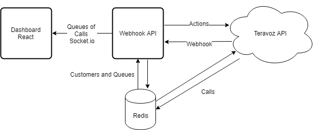

# Teravoz Challenge

This is an implementation of the [Terravoz Challenge](https://github.com/teravoz/challenge/blob/master/README.md).

## Requirements and Solutions

- Listen to events emitted by Teravoz at `/webhook` endpoint. Events are and come in the following order: `call.new`, `call.standby`, `call.waiting`, `actor.entered`, `call.ongoing`, `actor.left`, `call.finished`. Those are life cycle events of a call:

  - S1: A Node application ([teravoz-api](https://github.com/teravoz/challenge/blob/master/README.md)) was created to generate random calls and emmitting the life cycle events in the correct order.
  - S2: Another Node application ([webhook](https://github.com/teravoz/challenge/blob/master/README.md)) was created to listen for Teravoz events at `/webhook` endpoint, handling the events, calls, customers and queues.

- When an event of type _call.standby_ arrives, you need to **delegate** that call based on the given criteria above, by POSTing to Teravoz API's `/actions` endpoint:

  - S3: When an event of type _call.standby_ arrives the [webhook](https://github.com/teravoz/challenge/blob/master/README.md) application **delegate** the call after check if the customer exists based on the phone number. This application manage three queues of calls: `Active calls of new customers (900)`, `Active calls of returning customers (901)` and `Last finished Calls (999)`.

- When app is restarted, it needs to work as if it hasn't at all - returning customers will always be returning customers:

  - S4: The [teravoz-api](https://github.com/teravoz/challenge/blob/master/README.md) and [webhook](https://github.com/teravoz/challenge/blob/master/README.md) applications use a [Redis](https://github.com/teravoz/challenge/blob/master/README.md) client to persist the calls, customers and queues.

- Use of Docker containers:

  - S5: A [docker-compose](https://github.com/teravoz/challenge/blob/master/README.md) file was created to configure all application's services. A Dockerfile was defined for each aplication: [teravoz-api](https://github.com/teravoz/challenge/blob/master/README.md), [webhook](https://github.com/teravoz/challenge/blob/master/README.md) and [dashboard](https://github.com/teravoz/challenge/blob/master/README.md)

- A little dashboard in React or other library, showing current active calls:

  - S6: A simple React application ([dashboard](https://github.com/teravoz/challenge/blob/master/README.md)) was created to show the `Active calls of new customers`, `Active calls of returning customers` and `Last finished calls`.

The high-level architecture showed bellow summarize the solution described above.



## Running the application

### Docker

The simplest way to run this application is using [`docker-compose`](https://docs.docker.com/compose/):

```bash
# Creates the images with the transpiled Javascript files
docker-compose build
# Starts the applications
docker-compose up
```

### Standalone

To run the application as standalone services, for each service, run:

```bash
cd ./apps/<service>
npm run install
npm run start
```

Applications URL:

```bash
# Teravoz API
http://localhost:3001/webhook

# Webhook API
http://localhost:3001/webhook

# Dashboard
http://localhost:3001/webhook
```
